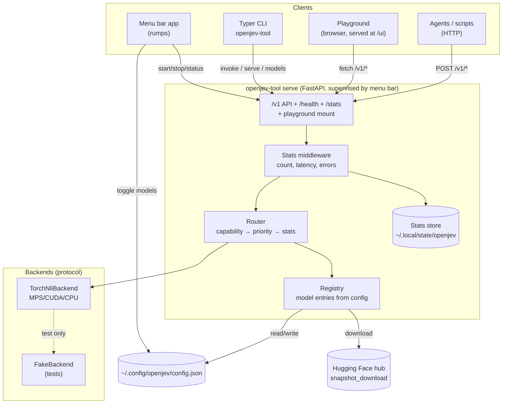

# openjev-tool v2 — Architecture

A local judgment-model server with a macOS menu bar controller, a multi-model
registry with routing, and a playground that exercises the full "10 levels of
Jev" ladder for agentic engineers.

Status: **as built (v2.0)** — phases 1–5 delivered · Design agreed with Dennis
(2026-09-29). Deltas from the original proposal are listed in §14.

---

## 1. Vision

openjev-tool today is a Typer CLI wrapping one pinned HF checkpoint
(`AlexWortega/openjev`, a Qwen3.5-4B 3-way NLI cross-encoder) with five
judgment commands and a single-model `serve`. It works, but it is
single-model, single-process, and has no operational surface.

v2 turns it into a **local judgment service**:

- a **server** that hosts any number of registered HF NLI cross-encoders,
- a **registry + downloader** so models are config entries, not code constants,
- a **router** that picks the best enabled model per request (capability →
  priority → live stats),
- a **menu bar app** (rumps) to start/stop the server, toggle models, and watch
  stats from the macOS toolbar,
- a **web playground** served by the server itself: pick a level (1–10), type a
  prompt, see the typed judgment come back — plus the exact curl/CLI to replay it.

Everything stays in one uv/Python 3.14 project, typed strict, AI-agent-first:
every surface (CLI, HTTP, playground) ships copy-pasteable examples.

### Confirmed decisions

| Decision | Choice |
|---|---|
| Menu bar tech | rumps (Python) + web playground opened from the menu |
| Inference backend v1 | torch/transformers on MPS, behind a `ModelBackend` protocol |
| Registry scope | Judgment models only (HF NLI cross-encoders) — no generative LLMs, no cloud |
| Router policy | Deterministic: capability filter → configured priority → live stats |
| Config location | `~/.config/openjev/config.json` (XDG) |

---

## 2. The 10 levels of Jev (playground presets)

Reconstructed from the transcript of IndyDevDan's "10 Levels of Jev For
Agentic Engineers" (`docs/transcript/indydevdan-jev.txt`) — the levels below
use the video's own use cases as fixtures. Levels 3/4/5 have garbled
on-screen titles in the auto transcript and are named from their demo
content. Every level is a playground preset: pre-filled input, a one-line
explanation, the response rendered, and the replayable curl/CLI.

| Level | Name | Primitive(s) | Video use case |
|---|---|---|---|
| 1 | Basic Decision | noul | Prompt-injection detection (smart yes/no if-statement) |
| 2 | Multiple Choice | choice | Support-ticket triage: category + priority |
| 3 | Score & Weights | score | Priority scoring with in-code weights |
| 4 | Tool Safety | noul | `rm -rf node_modules` — reversible / safe to execute? |
| 5 | Ask Multi | ask | Booleans + choices + scores in one call |
| 6 | Jev Guard | noul | Block destructive/irreversible commands and `.env` writes |
| 7 | Should I Compact | noul | Self-compacting harness: 6k notice / 10k recommend / 14k request |
| 8 | Cheap File Reads | ask | Classify files without reading them, one call many answers |
| 9 | Harness At Scale | ask | ask-jev tool calls throughout the agent harness |
| 10 | Agent-to-Jev | ask | The agent calls Jev itself: classify failure, validate fix, risk |

The ladder doubles as the tool's test matrix: each level maps to a playground
fixture and a pytest against a `FakeBackend` (no torch needed in CI).

---

## 3. Component architecture



### Process model

- `openjev-tool serve` is the single long-running process; it owns model
  loading (lazy, on first use per model) and stats.
- The menu bar app **supervises** it: spawns `openjev-tool serve --supervised`
  as a child, polls `GET /health`, mirrors state in the icon (stopped /
  starting / running / error). Stop = SIGTERM → grace → SIGKILL.
- If a server is already running on the configured port (started from the
  CLI), the menu bar attaches to it instead of spawning a second one.
- Pidfile under `~/.local/state/openjev/server.pid`; `--supervised` writes it
  on boot and removes it on shutdown.

---

## 4. Configuration — `~/.config/openjev/config.json`

One file, XDG paths, atomic writes, versioned schema. Managed from the menu
bar, the playground settings page, or `openjev-tool config set …`.

```json
{
  "version": 1,
  "server": { "host": "127.0.0.1", "port": 8080 },
  "models": [
    {
      "id": "openjev-qwen3.5-4b",
      "repo": "AlexWortega/openjev",
      "subfolder": "qwen3.5-4b-nli",
      "revision": "f8187e6e11d413d0771bcc7970b85f78e194264c",
      "labels": ["contradiction", "entailment", "neutral"],
      "template": "Premise: {premise}\nHypothesis: {hypothesis}",
      "capabilities": ["score", "noul", "choice", "rerank", "grade"],
      "priority": 10,
      "enabled": true
    },
    {
      "id": "mnli-roberta-large",
      "repo": "roberta-large-mnli",
      "revision": "main",
      "labels": ["contradiction", "neutral", "entailment"],
      "template": "Premise: {premise}\nHypothesis: {hypothesis}",
      "capabilities": ["noul", "score"],
      "priority": 5,
      "enabled": false
    }
  ],
  "router": { "policy": "capability-priority-stats" },
  "stats": { "persist": true }
}
```

Notes:

- `labels` order matters — it defines the logits→semantics mapping per model
  (MNLI family checkpoints differ in label order; this is the classic footgun
  the registry removes).
- `priority` is an int; higher wins among models whose capabilities match.
- Adding a Hugging Face model = adding an entry (menu bar "Add model…" opens
  the playground settings form; CLI: `openjev-tool models add`).

---

## 5. HTTP API (v2)

Versioned under `/v1`; the v1 endpoints (`/score`, `/noul`, …) keep working as
aliases so existing scripts and the current CLI `--server` mode do not break.

| Endpoint | Purpose |
|---|---|
| `GET /health` | `{status, uptime_s, version, levels}` — menu bar polls this |
| `GET /stats` | Totals + per-model/per-endpoint count, p50/p95 latency, errors, memory |
| `GET /v1/models` | Registry state: enabled, loaded, capabilities, priority, downloaded |
| `GET /v1/levels` | The ladder table with examples (drives the playground) |
| `GET /v1/config` | The live config document |
| `PUT /v1/config` | Validate, persist, and hot-apply a full config (playground settings + model checkboxes) |
| `GET /v1/reload` | Re-read config.json after external edits |
| `POST /v1/score` | Degree judgment on [-1, 1] (as today) |
| `POST /v1/noul` | True/false/unknown verdict (as today) |
| `POST /v1/choice` | Pick from options + distribution (as today) |
| `POST /v1/rerank` | Rank options by entailment (as today) |
| `POST /v1/grade` | Candidate vs. reference verdict (as today) |
| `POST /v1/ask` | Batch: several independent questions over one state, one round trip (level 10) |
| `POST /v1/invoke` | Level-based dispatch: `{level: 1..10, payload}` → routed judgment (playground uses this) |
| `GET /ui` | Web playground (single static page) |

Every response carries `"routing": {"model": "...", "reason": "..."}` so
router decisions are explainable and testable. An optional `"model"` key in
any judgment request pins routing to that model (404 unknown, 422 disabled or
capability-mismatched).

---

## 6. Router

Pure function, deterministic, unit-tested:

```
route(endpoint, models, stats) -> (model, reason)
  1. keep models where endpoint ∈ capabilities and enabled and downloadable
  2. no candidates -> 503 with the reason ("no enabled model supports rerank")
  3. sort by (priority desc, success rate desc, p50 latency asc)
  4. return top + human-readable reason
```

v1 deliberately avoids learned routing (bandit/Elo). The stats exist and are
visible, so a learned policy can be added later behind the same `router.policy`
config key without API changes.

---

## 7. Model backend protocol

```python
class ModelBackend(Protocol):
    id: str
    capabilities: tuple[str, ...]

    def load(self) -> None: ...
    def unload(self) -> None: ...
    def is_loaded(self) -> bool: ...
    def predict_probs(self, pairs: list[tuple[str, str]]) -> list[list[float]]: ...
```

- `TorchNliBackend` wraps the existing `_load_model`/`_predict_probs` logic
  (moved out of `jev.py` unchanged in spirit, label order from config).
- `FakeBackend` returns deterministic probabilities — used by tests and by
  `OPENJEV_FAKE=1` so the playground/API can be developed without the 8 GB
  checkpoint.
- Load policy v1: lazy load on first use, unload only on explicit request or
  server stop (an M4 has room for one 4B fp16 model comfortably; multi-load
  comes with a memory-aware LRU later).

---

## 8. Menu bar app (rumps)

`openjev-tool menubar` — the toolbar icon with four states:

- Icon: template image (monochrome macOS style); states: stopped (hollow),
  starting (half), running (filled), error (dot). Shipped as SVG → PNG assets.
- Menu layout:

```
● Running — 127.0.0.1:8080        (status line, click = open playground)
────────────────────────────
  Start Server / Stop Server
  Open Playground                 (http://127.0.0.1:8080/ui)
────────────────────────────
  Models
    ✓ openjev-qwen3.5-4b          (checkbox -> config.json)
    ☐ mnli-roberta-large
    Add Model…                    (opens playground settings)
────────────────────────────
  1,284 invocations · p50 84 ms   (stats line, live)
  Server Settings…                (port/host form -> config.json)
────────────────────────────
  Quit
```

- Checkboxes and settings write `~/.config/openjev/config.json` and, when the
  server is running, `POST` a config-reload so changes apply without restart.
- rumps is the only new runtime dep for this component (PyObjC-backed, uv-installable).

---

## 9. Playground (server-served web UI)

Mounted at `/ui` from `openjev_tool/playground/static/` — one `index.html` +
vanilla JS (fetch only, no node build step, no CDN dependency).

Layout, one screen:

```
┌───────────────────────────────────────────────┐
│ Level [1–10 ▾]   Model [auto ▾]   [Invoke]    │
│ ───────────────────────────────────────────── │
│ Input                                          │
│ ┌───────────────────────────────────────────┐ │
│ │ (level-specific form: premise/claim,      │ │
│ │  question/options, scale levels, …)       │ │
│ └───────────────────────────────────────────┘ │
│ Output                                         │
│ ┌───────────────────────────────────────────┐ │
│ │ {typed judgment JSON, pretty-printed}     │ │
│ │ routing: openjev-qwen3.5-4b (priority)    │ │
│ └───────────────────────────────────────────┘ │
│ $ curl -s localhost:8080/v1/invoke …  [copy]  │
└───────────────────────────────────────────────┘
```

- Level dropdown = the 10-level ladder; selecting a level loads its fixture
  and form shape.
- Model dropdown defaults to `auto` (router); explicit pick pins the model.
- The replay block shows the exact curl **and** CLI command — AI-first: an
  agent reading the playground learns the API by copying.
- Settings page (linked from menu bar): server host/port, model add/edit form
  — writes the same config.json.

---

## 10. Repo layout (rewrite)

```
openjev_tool/
  app.py             # make_app (existing convention)
  cli.py             # root app: serve | menubar | models | config | jev | completion
  config.py          # Config/ModelEntry dataclasses, XDG paths, atomic save, reload
  registry.py        # registry: resolve entries, download via snapshot_download
  backend.py         # ModelBackend protocol, TorchNliBackend, FakeBackend, loader
  router.py          # pure deterministic router
  stats.py           # StatsCollector: counters, latency histograms, persistence
  server.py          # FastAPI app factory, /v1 routes, stats middleware, reload
  playground.py      # mounts static UI; static/index.html lives beside it
  menubar.py         # rumps app + server supervisor
  jev.py             # pure result builders (kept from v1 — already tested)
  logging_config.py  # unchanged
  telemetry/         # unchanged
tests/
  test_config.py     # round-trip, atomic write, defaults
  test_router.py     # capability/priority/stats ordering, 503 case
  test_stats.py      # aggregation, p50/p95
  test_server.py     # TestClient + FakeBackend: all endpoints + routing echo
  test_playground.py # /ui served, fixtures valid JSON
  test_jev.py        # builders (kept)
  test_menubar.py    # menu structure + config sync helpers (pure parts)
```

CLI surface after the rewrite (all existing commands keep working):

```
openjev-tool serve [--host --port --supervised]
openjev-tool menubar
openjev-tool models list|add|remove|download|enable|disable
openjev-tool config show|set|path
openjev-tool jev score|noul|choice|rerank|grade|download   # unchanged, now router-aware
openjev-tool completion generate <shell>
```

---

## 11. Stats

- In-memory counters + latency ring buffer per (endpoint, model).
- `GET /stats` returns totals, per-model p50/p95, error counts, uptime,
  loaded models and approximate memory.
- Persisted as JSON snapshots to `~/.local/state/openjev/stats.json` every 30 s
  and on shutdown — no database dependency.
- Menu bar shows a one-line summary; playground renders the full table.

---

## 12. Roadmap

| Phase | Deliverable | Gate |
|---|---|---|
| 1 | `config.py` + `registry.py` + `backend.py` protocol; `models` CLI group; existing `jev` commands work through the registry | `make pipeline` |
| 2 | `server.py` v2: `/v1` API, stats middleware, router, v1 aliases, `/v1/ask`, `/v1/invoke` with FakeBackend tests | `make pipeline` |
| 3 | Playground `index.html` + fixtures for levels 1–10 | manual + `test_playground.py` |
| 4 | `menubar.py`: supervisor, icon states, model checkboxes, settings, stats line | manual smoke + pure-helper tests |
| 5 | Docs: README rewrite, this doc updated to "as built", level-by-level examples | review |

Each phase is shippable on its own; phases 1–2 carry all pure-logic test mass.

---

## 13. Risks / open points

- rumps/PyObjC adds a native dependency to the uv env — acceptable on macOS;
  the server and CLI never import it (menubar is an optional extra).
- Label-order differences across MNLI-family checkpoints are the #1 correctness
  risk — mitigated by explicit `labels` in config and per-model fixtures.
- torch model load (~7 s on M4 Pro) means the first request after a model
  switch is slow; the playground shows a running state while it warms up.
- `/v1/ask` (level 10) defines the batch contract now but runs questions
  sequentially through the runner — no async worker queue in v1.

## 14. Deltas from the proposal (as built)

- Downloads use an observer/observable model
  (``openjev_tool/downloader.py``): huggingface_hub's ``tqdm_class`` hook is
  bridged into a ``DownloadTracker`` that publishes immutable
  ``DownloadProgress`` snapshots (bytes done/total, windowed throughput, ETA)
  to any observer — the menu bar item title and the CLI stderr line are both
  observers of the same stream. hf-xet (chunk-based) is active by default;
  ``--hf-transfer`` opts into the Rust multi-chunk engine at the cost of
  coarser progress. Entries can pin ``include_patterns`` so root-layout repos
  fetch only the needed weights (the small default model downloads 17 MB, not
  the 4 GB all-variants snapshot).
- Menu bar states are title glyphs (`○ ◐ ● ✕ jev`) instead of image assets —
  no binary icon to ship; a template image can replace the title later.
- Models show a monochrome `· cached` / `· not cached` marker (native menus
  cannot host colored badges or progress bars); a Download menu lists
  uncached models and reports live progress as item-title text
  (percent when the hub total is known, else bytes), with a completion
  notification. Notifications fall back to alerts when no bundle
  ``Info.plist`` exists; the menubar writes the bundle shim automatically.
- ``~/.config/openjev/config.json`` is materialized automatically by
  ``ensure_config()`` at serve/menubar/registry startup and via
  ``openjev-tool config init|path|show|set``.
- The default registry includes a small model
  (``cross-encoder/nli-deberta-v3-small``, ~142 MB) for quick experiments.
- `/v1/reload` is a GET (idempotent read-side reload), and `GET`/`PUT
  /v1/config` were added so the playground settings form and model checkboxes
  persist config through the server instead of only writing the file.
- Judgment requests accept an optional `model` key to pin routing (playground
  model dropdown).
- `menubar` is an optional `[menubar]` extra (`rumps` + PyObjC); the server
  and CLI never import it.
- Stats persist every 20 records and on shutdown (deterministic, no background
  timer).
